# CyBench Eclipse plugin

## Installation instructions

**Prerequisites**
* Plugin is build and tested using (on lower JAVA or Eclipse version it won’t work)
    * JAVA – JDK-14.0.2,
    * Eclipse Version: 2020-09 (4.17.0).

**Deployment package**

* File `CybenchTools.zip` contains Eclipse update site files structure.

###Installation from local file system

* In Eclipse select menu “Help”→ “Install new software”.
* In installation dialog window click button “Add”.
* Click button “Archive...”.
* Navigate to folder which contains CyBench Tools update site archive (zip) and select it.
* Type in “Name” - “CyBench Tools Local Install”.

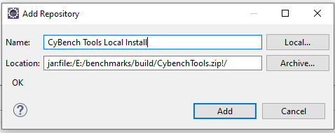

* Click button "Add".
* In installation dialog window deselect check box “Group items by category”, then list of features shall appear in the table.

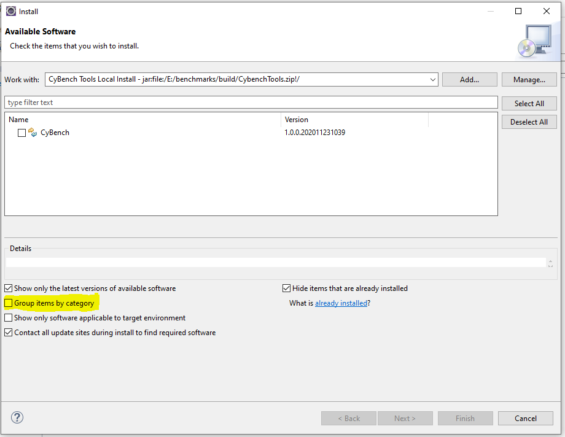

* Check “CyBench” entry in the features table.
* Click button “Next”.
* Installation details window appears. Click button “Next”.
* Licenses review window appears, select “I accept the terms of the license agreement”, click button “Finish”.
* Warning box appears, click button “Install anyway”.

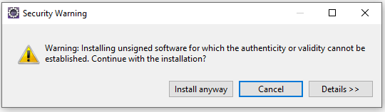

* Restart Eclipse workspace, click button “Restart Now”.
* Plugins shall be visible under Eclipse installation details:
    * CyBench branding icon shall be visible under installed plugins bar.
    * Installed software, Features and Plug-ins shall contain CyBench software items.

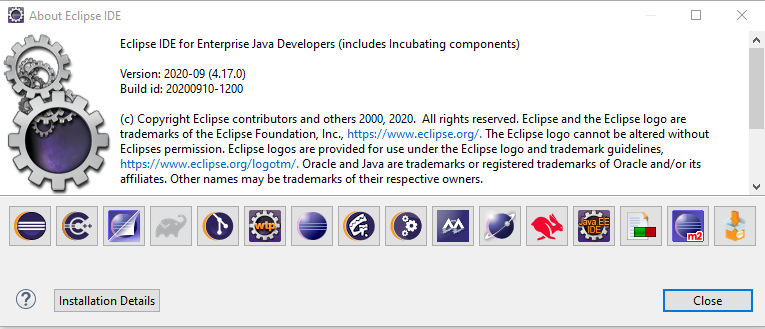

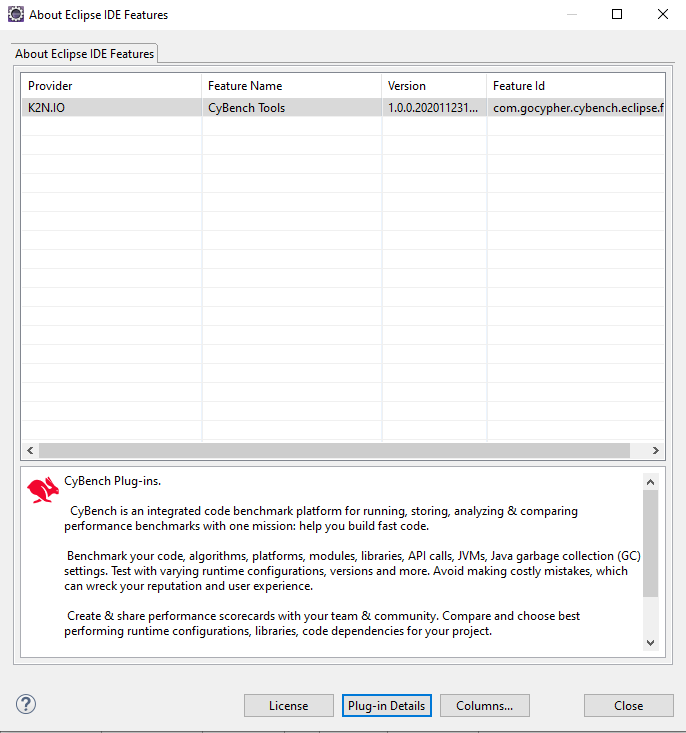

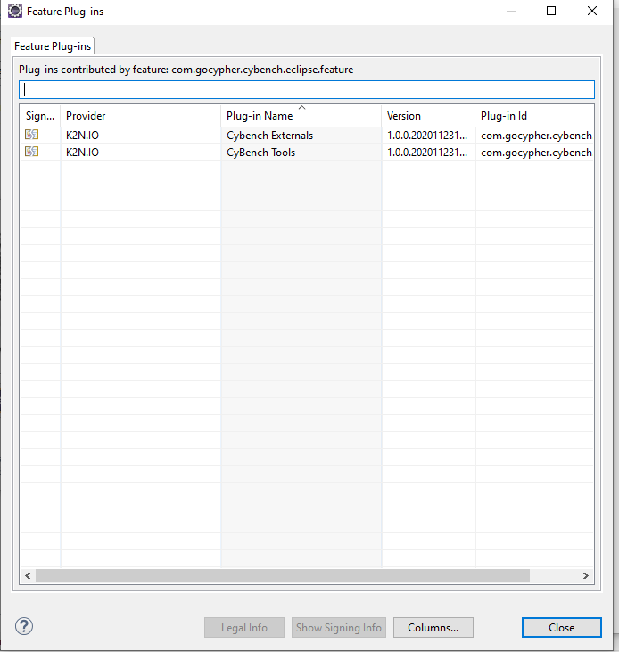

##Uninstall

* Applicable if CyBench tools were used in developer mode:
    * Stop the Eclipse.
    * Navigate to drop ins directory of the Eclipse IDE (for example: `c:\eclipses\eclipse-2020-09-R\dropins\`).
    * Delete files which contains word `cybench` in their file name.
    * Start Eclipse again.
* Applicable if CyBench tools were installed using update site package:
    * Select Eclipse menu Help→ About Eclipse IDE → Click Installation Details.
    * In the `Installed Software` tab select table item which has name `CyBench` 
    * Click button `Uninstall`.
    * Restart Eclipse when requested.

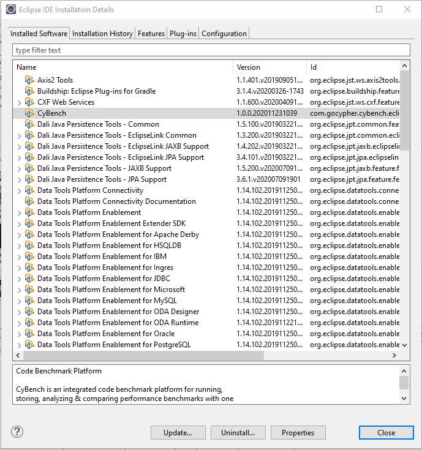

##Usage Instructions

###Project nature “CyBench Nature”

CyBench project nature applies settings to the project that benchmarks are compiled with all annotations and contains all required dependencies at least for startup. It is possible to override project configuration changes made by CyBench plugin; it just configures items which are necessary for successful launch. Project nature must be “CyBench Nature” in order to use further CyBench tools.

**Steps:**

* Right click mouse button on the project.
* Select “CyBench” → “Add CyBench Nature”.
* CyBench nature shall be added.

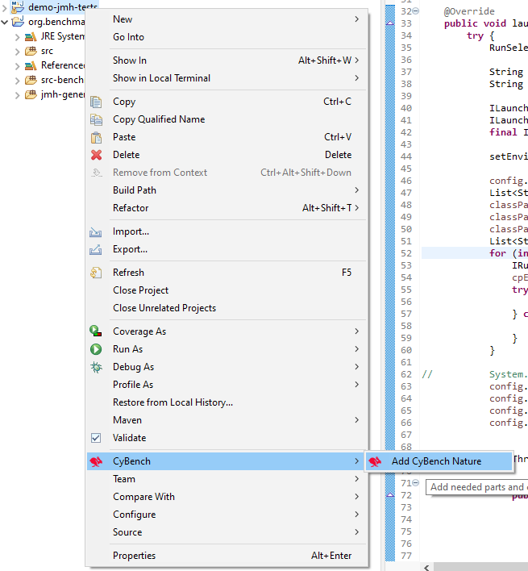

Adding CyBench nature will make the following changes to the project settings:
* Will add nature tag to the project settings (`.project file`).

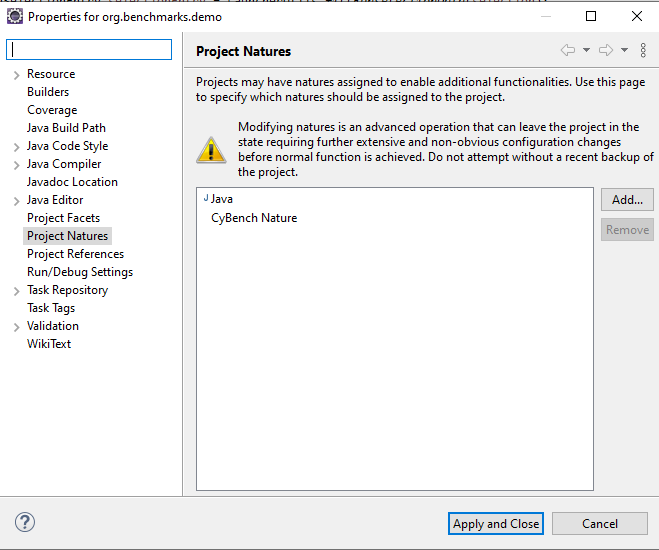

* Will add external dependencies to JMH framework
    * If project is JAVA project then will set build path to point to CyBench plugin as external library link.
    * If project is Maven project then will add dependencies to JMH into POM file.
* Will update compiler settings in order to use annotation processing during file compilation:
    * Enables annotation processing and sets extra source folders for processed files.
    * Enables and adds annotation factory which points to CyBench plugin as external library link.

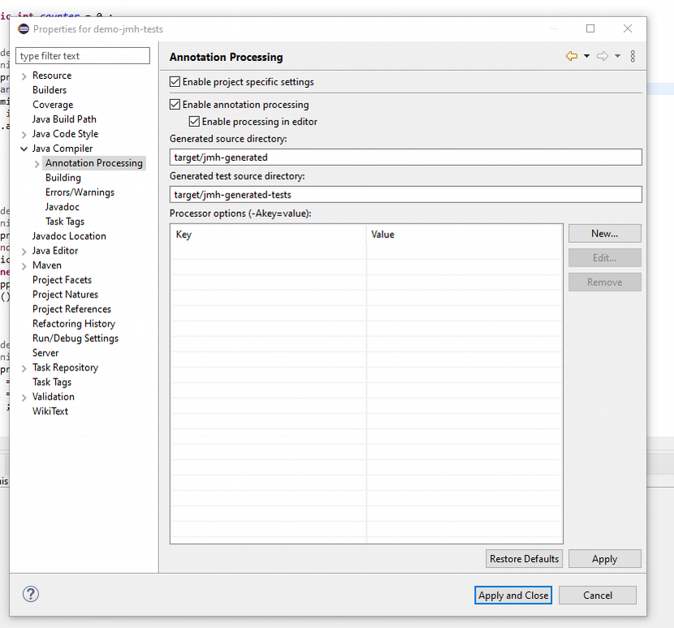

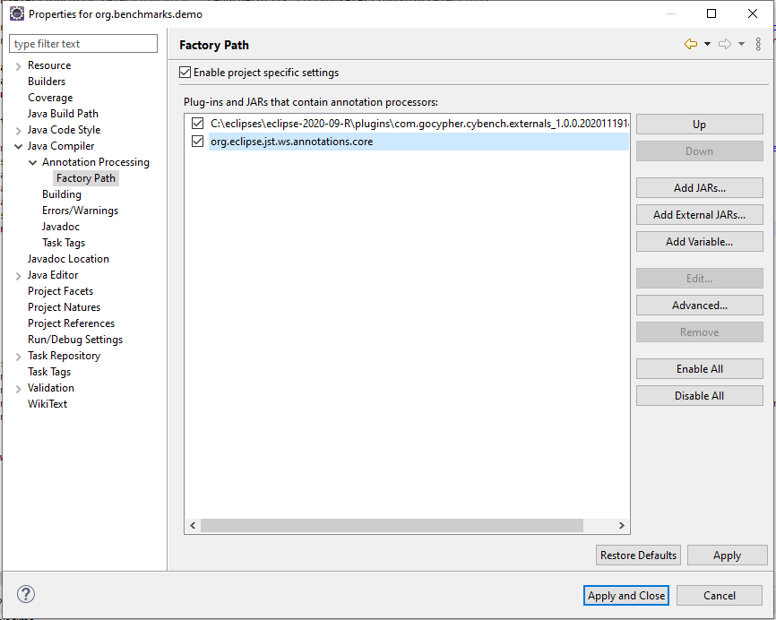

This configuration triggers, any JMH benchmarks implementing class recompile and its annotations transformation into JMH types which shall be placed under directories defined in “Annotation Processing” window. 

Configuration allows to run CyBench launcher without any other specific rebuild and this does not depend on project nature. Also this allows to use JMH framework in Eclipse for generic Eclipse JAVA project without Maven usage.

##CyBench Explorer View

View displays all CyBench reports found in the workspace projects.
* To open this view navigate “Window”→”Show View” → “Other” → “CyBench Tools” → “CyBench Explorer”. If Java perspective is active then it opens on the right side of the screen otherwise opens at the bottom, and can place it anywhere.

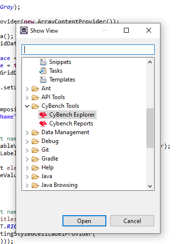

* Double click with mouse on the report entry and it will open a view with report details.

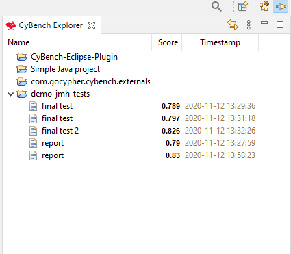

##Report Details View

View displays selected or generated during launch report details.
* Displays a list of benchmark tests on the right.    
* View open position is at the bottom of the screen, either when report is selected via “CyBench Explorer” or after launch benchmarks using “CyBench launcher”

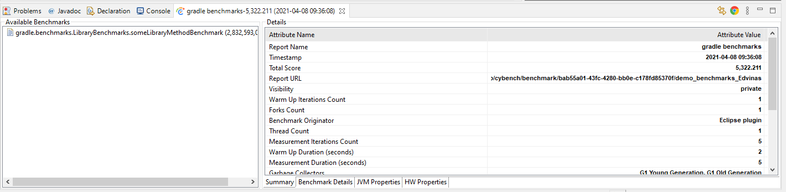

* Double click mouse on “Available Benchmarks” entries on the left size of the view and it will display selected benchmark details in the right sideof the view, tab “Benchmark Details”.
* Also can navigate thorough other report attributes by clicking on the appropriate “tab” - “Summary”, “JVM Properties”, “HW Properties”.
* Chrome icon at the top-right view side allows to open the report using default system Web browser (which is defined in Eclipse settings) i.e. navigate to CyBench website to particular report details page (if the report was sent to CyBench Repository).

##Generate Benchmarks

Feature generates benchmark class stubs, adds necessary annotations and methods for a selected JAVA file. Benchmark method is generated for each public method found in the class.

**Pre-conditions**

* `CyBench Nature` for a project,
* selected file extension `.java`,
* selected file located not in a benchmarks folder.

**Steps:**

* Select any JAVA class file in the project explorer which meets pre-conditions.
* Right click mouse button on it.
* Select CyBench→CyBench Generate.

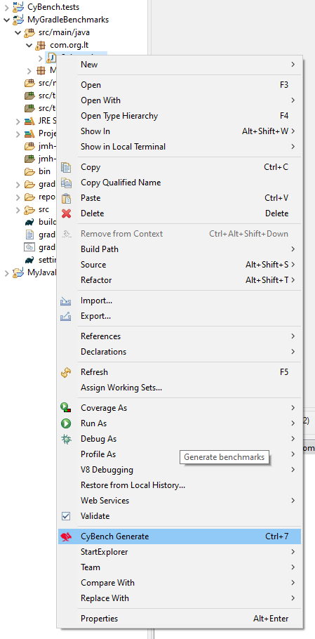

* New JAVA classes with benchmark test stubs shall be generated under new src folder:
    * for JAVA projects - `src-benchmarks`,
    * for Maven projects – `src/test/java` (default folder for tests).
* Newly generated classes shall be immediately pre-processed using JMH annotation processors and places under folders defined in a project annotation processing settings.

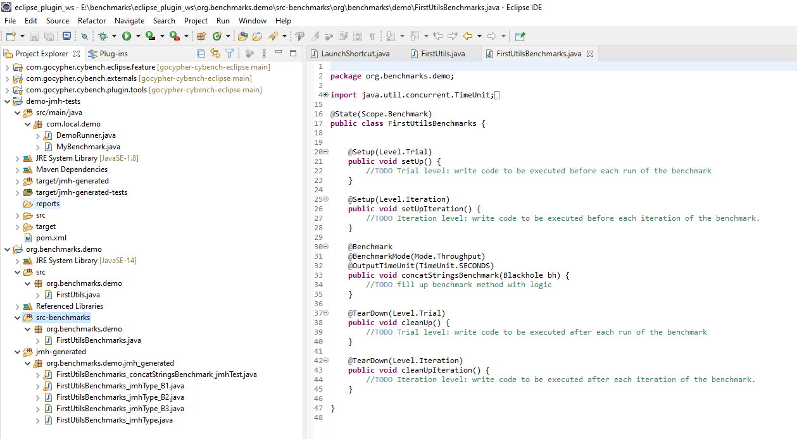

##Quick launch benchmarks using CyBench

Launches all JMH benchmarks which are found under selected JAVA file. Quick launch does not collect hardware or JVM settings and does not send report to CyBench repository.

**Pre-conditions**

* `CyBench Nature` for a project.

**Steps:**

* Right click on the JAVA file which contains JMH Benchmarks.
* Select “Run As”→ “Run on CyBench”. 

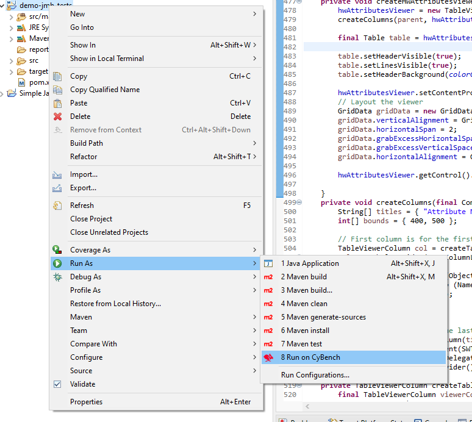

* CyBench launcher will start display messages in the console view.
* After launcher finishes its work:
    * report file is created under `<selected project/reports>` folder, 
    * report is displayed under “Report Details View”,
    * report entry appears in “CyBench Explorer”.

##CyBench Run Configuration and Launch View

Launch configuration view which allows to create a custom launch settings for a selected workspace project and run CyBench launcher using user defined settings.

**Steps:**

* Select menu→ “Run”→ “Run Configurations”.
* In the “Run Configurations” dialog window click on item “CyBench” and click “Create New” button
* Define configuration for CyBench launcher in tab “CyBench Properties”.
    * Important options:
        * “Run Project” - select the project which contains JMH benchmarks.
        * “Reports Folder” - folder where CyBench reports are stored, default is the location of the “Run Project” option plus “/reports” subdirectory.
        * “Send Report To CyBench” - flag which defines that either report should be sent to CyBench repository or not.

* Click “Apply” → “Run” to start execution of the selected project benchmarks  .      
* CyBench launcher will start display messages in the console view.
* After launcher finishes its work:
    * report file is created under `<selected project/reports>` folder, 
    * report is displayed under “Report Details View”, 
    * report entry appears in “CyBench Explorer”.